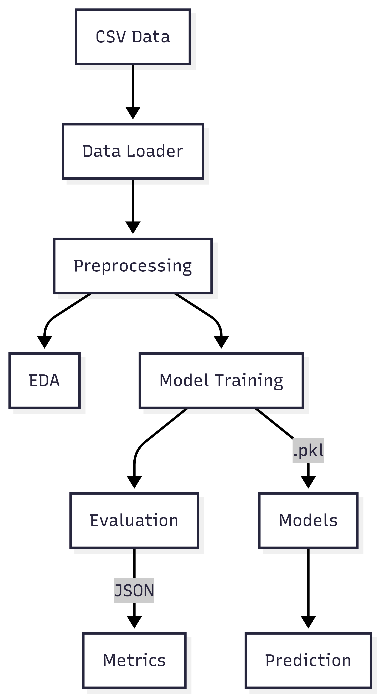

---

## title: Architecture

## 📐 Project Architecture

This section explains the folder structure and pipeline flow.

### 🗂 Project Structure

```
student-grade-prediction/
│── data/                     # Raw datasets
│   ├── student-mat.csv
│   ├── student-por.csv
│   └── ...
│
│── notebooks/                # Experiments/EDA
│   ├── 01_data_exploration.ipynb
│   ├── 02_feature_engineering.ipynb
│   └── 03_modeling.ipynb
│
│── results/                  # Outputs: logs, metrics, models, figures
│   ├── figures/              # EDA plots
│   ├── logs/                 # Logs from runs
│   ├── metrics/              # Evaluation reports (.csv)
│   └── models/               # Saved pipelines (.pkl)
│
│── src/                      # Source code (modular + reusable)
│   │── __init__.py
│   │
│   ├── data_loader.py        # Load raw datasets
│   ├── preprocessing.py      # Build preprocessing transformers
│   ├── eda.py                # EDA utilities
│   ├── model.py              # Train, evaluate, save pipeline
│   ├── utils.py              # Logging, helpers
│   ├── main.py               # CLI: train + evaluate + save
│   └── predict.py            # CLI: load model + predict on new data
│
│── requirements.txt          # Dependencies
│── README.md                 # Documentation
```

## 🔄 Workflow

1. **Load Data** → CSVs loaded into DataFrames
2. **Preprocess** → Missing values, encoding, scaling
3. **EDA** → Distributions, correlations
4. **Model Training** → Train & evaluate models
5. **Save** → Metrics (.csv) and models (.pkl)

## 🖼 Visual Diagram



*(Diagram will be added to illustrate pipeline flow)*

---

[⬅️ Home](index.md) | [➡️ Next: Usage](usage.md)
