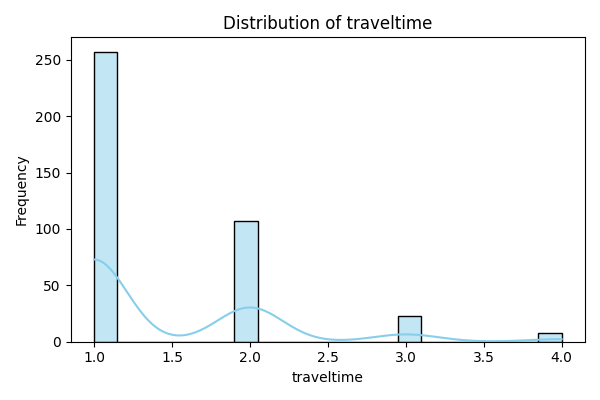

# 📊 Results Figures

This page shows exploratory data analysis (EDA) figures for both the **Mathematics** and **Portuguese** datasets.

## 📘 Mathematics Dataset

### Grade Distributions

**First Period (G1)**  

**Second Period (G2)**  

**Final Grade (G3)**  

### Lifestyle & Behavioral Variables

**Freetime**  

**Going Out with Friends**  

**Health**  

**Weekday Alcohol (Dalc)**  

**Weekend Alcohol (Walc)**  

### Demographics & Study Patterns

**Mother's Education (Medu)**  

**Father's Education (Fedu)**  

**Study Time**  

**Travel Time**  

**Age**  

### Academic Risk Factors

**Absences**  

**Failures**  

**Family Relations**  

### Correlation Analysis

**Mathematics Dataset Correlation Heatmap**  

---

## 📙 Portuguese Dataset

### Grade Distributions

**First Period (G1)**  

**Second Period (G2)**  

**Final Grade (G3)**  

### Lifestyle & Behavioral Variables

**Freetime**  

**Going Out with Friends**  

**Health**  

**Weekday Alcohol (Dalc)**  

**Weekend Alcohol (Walc)**  

### Demographics & Study Patterns

**Mother's Education (Medu)**  

**Father's Education (Fedu)**  

**Study Time**  

**Travel Time**  

**Age**  

### Academic Risk Factors

**Absences**  

**Failures**  

**Family Relations**  

### Correlation Analysis

**Portuguese Dataset Correlation Heatmap**  

---

## 🔍 Key Observations

- **Grade Distributions:** G1, G2, and G3 show similar patterns across both datasets
- **Behavioral Variables:** Most students report moderate levels of freetime, socializing, and alcohol consumption
- **Demographics:** Parental education levels cluster around secondary education
- **Correlation Patterns:** Strong positive correlation between period grades (G1, G2) and final grade (G3)

---

[⬅️ Back: Results](results.md) | [➡️ Next: Discussion](discussion.md)
